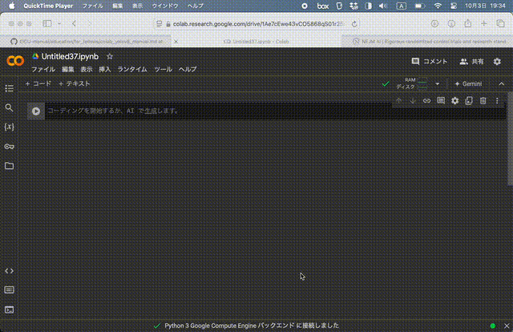

# YOLOv8動画処理のためのGoogle Colabマニュアル

このガイドは、初心者がGoogle Colab上でコードを実行し、必要なファイルをダウンロードして設定する方法を説明します。これにより、YOLOv8を使用して動画内の人物を検出し、カウントすることができます。

## 1. Google Colabを開く
- (リンクを右クリックして新規ダブで開いてください)  
<a href="https://colab.research.google.com" target="_blank">Google Colab</a>にアクセスし、「+ ノートブックを新規作成」をクリックして、新しいノートブックを作成します。
	
## 2. 必要なライブラリのインストール
コードを実行するために、必要なライブラリをインストールします。以下のコードをColabのセルにコピーして実行してください。

```python
!pip install ultralytics opencv-python-headless
```

これにより、YOLOライブラリ（`ultralytics`）とOpenCVがインストールされます。

## 3. YOLOモデルのダウンロード
YOLOv8のモデル（`yolov8n.pt`）をダウンロードする必要があります。下に新しいセルを作成して、以下のコマンドを記述し、実行してモデルをダウンロードしてください。

```python
!wget https://github.com/ultralytics/assets/releases/download/v0.0.0/yolov8n.pt -O yolov8n.pt
```

このコマンドにより、YOLOv8のnanoバージョンのモデルがColabの現在のディレクトリに保存されます。

## 4. 動画ファイルのアップロード
  
次に、動画ファイル（`710560399.045479.MP4`などのMP4ファイル）をGoogle Colabにアップロードします。画面の一番左にフォルダのアイコンがあります。これをクリックして、フォルダを開いてください。そして、そこに動画ファイルをドラッグ&ドロップで追加してください。これでローカルの動画ファイルをアップロードできます。

## 5. パスの設定とコードの実行
動画ファイルのパスとモデルのパスを設定します。アップロードした動画ファイルの名前を確認し、それを`video_path`に指定してください。  
新しいセルを作り、このコードを書いて、実行すれば、パスを指定できます。

```python
video_path = "710560399.045479.MP4"  # アップロードした動画ファイルの名前に置き換えてください
yolo_model_path = "yolov8n.pt"  # ダウンロードしたYOLOモデルのファイル名
```

次に、その下にさらに新しいセルを作成してください。  
そして、この説明文の一番最後にある **「コード - 動画から人数を検出」** をColabにコピーして貼り付けてください。そして、実行します。

## 6. コードの実行
コード全体を実行すると、動画内の人物をカウントし、その情報が`person_count_data.csv`というCSVファイルに保存されます。処理が完了すると、CSVファイルが生成されます。

## 7. 結果のダウンロード
最後に、生成されたCSVファイルをダウンロードします。以下のコードを使用してファイルをダウンロードできます。

```python
from google.colab import files
files.download("person_count_data.csv")
```

これにより、CSVファイルがローカルにダウンロードされ、分析に使用できます。

## 注意点
- 動画ファイルが大きい場合、処理に時間がかかることがあります。
- `display_frames`が`True`に設定されている場合、フレームを表示しようとしますが、ColabではGUIウィンドウを表示できないため、このオプションを`False`に設定することをお勧めします。

これで、初心者向けにGoogle Colabでこのコードを実行するための手順が完成しました。 
  
    

**「コード - 動画から人数を検出」**
```python
# %% import packages and libraries
import cv2
from ultralytics import YOLO
import time
import csv
import matplotlib.pyplot as plt
import pandas as pd

# --- パラメーター設定 ---
interval = 1  # 何秒の平均にするか
output_csv = "person_count_data.csv"  # 作成するCSVファイル名
target_frame_height = 240  # フレームの縮小高さ
display_frames = True  # フレームを表示するかどうか
PERSON_CLASS_ID = 0  # クラスID 0 は "person"

# video_path = "/Users/ryutaroseo/Library/CloudStorage/OneDrive-個人用/Dev/動体検知/動体検知_test/710560399.045479.MP4" # 動画ファイルのパス
# yolo_model_path = "yolov8n.pt"  # YOLOモデルのパス

# YOLOモデルをロード（最初に一度だけ実行）
model = YOLO(yolo_model_path)


def process_video(video_path, interval, output_csv):
    cap = cv2.VideoCapture(video_path)
    if not cap.isOpened():
        print(f"Error: Cannot open video file {video_path}")
        return

    frame_count = 0
    person_count = 0
    interval_start_time = 0  # インターバルの開始時間（ビデオの経過秒数）
    start_time = time.time()

    with open(output_csv, mode="w", newline="") as file:
        writer = csv.writer(file)
        # ヘッダーの変更
        writer.writerow(
            ["Start Time (s)", "End Time (s)", "Avg Person Count", "Frame Count"]
        )

        while cap.isOpened():
            ret, frame = cap.read()
            if not ret:
                break

            # フレームのビデオ内での経過時間を取得（ミリ秒を秒に変換）
            current_time_sec = cap.get(cv2.CAP_PROP_POS_MSEC) / 1000.0

            # アスペクト比を維持してフレームをリサイズ
            h, w = frame.shape[:2]
            aspect_ratio = w / h
            target_width = int(target_frame_height * aspect_ratio)
            frame = cv2.resize(frame, (target_width, target_frame_height))

            results = model(frame)
            frame_count += 1
            frame_person_count = 0  # このフレームで検出された人数

            for result in results:
                boxes = result.boxes
                for box in boxes:
                    x1, y1, x2, y2 = map(int, box.xyxy[0])
                    cls = int(box.cls[0])
                    if cls == PERSON_CLASS_ID:
                        frame_person_count += 1
                        if display_frames:
                            cv2.rectangle(frame, (x1, y1), (x2, y2), (0, 255, 0), 2)
                            cv2.putText(
                                frame,
                                "Person",
                                (x1, y1 - 10),
                                cv2.FONT_HERSHEY_SIMPLEX,
                                0.9,
                                (0, 255, 0),
                                2,
                            )

            # フレームごとの人数を集計
            person_count += frame_person_count

            # 指定した時間間隔（interval）ごとに平均人数を計算しCSVに書き込む
            if current_time_sec - interval_start_time >= interval:
                avg_person_count = person_count / frame_count if frame_count > 0 else 0
                interval_end_time = current_time_sec

                # CSVにデータを追記
                writer.writerow(
                    [
                        interval_start_time,
                        interval_end_time,
                        avg_person_count,
                        frame_count,
                    ]
                )

                # カウンタリセット
                frame_count = 0
                person_count = 0
                interval_start_time = (
                    interval_end_time  # 次のインターバルの開始時間を設定
                )

            if display_frames:
                cv2.imshow("Frame", frame)
                if cv2.waitKey(1) & 0xFF == ord("q"):
                    break

    cap.release()
    if display_frames:
        cv2.destroyAllWindows()

# 平均の人数をグラフにする関数を追加
def plot_average_person_count(csv_path):
    # CSVファイルを読み込み
    df = pd.read_csv(csv_path)

    # 平均人数をグラフにプロット
    plt.figure(figsize=(10, 6))
    plt.plot(df['End Time (s)'], df['Avg Person Count'], marker='o', linestyle='-')
    plt.xlabel('Time (s)')
    plt.ylabel('Average Person Count')
    plt.title('Average Person Count Over Time')
    plt.grid(True)
    plt.show()

def main():
    process_video(video_path, interval, output_csv)
    # 平均人数のグラフを表示
    plot_average_person_count(output_csv)

if __name__ == "__main__":
    main()

```