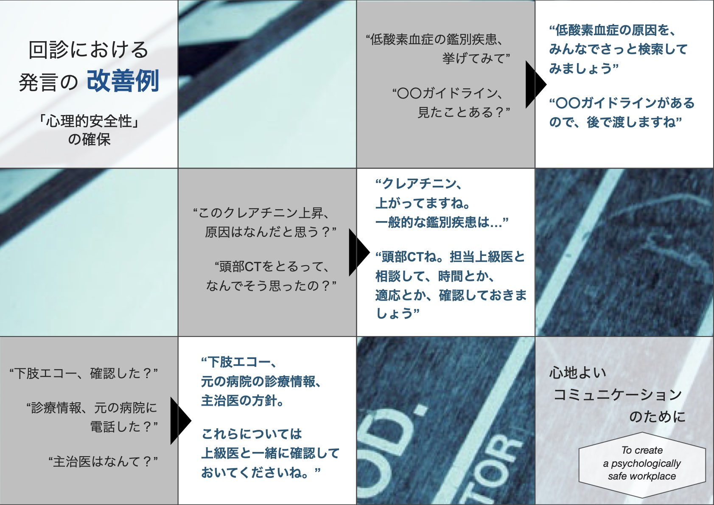

# EICU業務マニュアル
☆★適宜、必要に応じて見直し、共有します★☆  

* EICU当直医マニュアルは[こちら](EICU_manual_for_night_shift.md)
* 救急科入院患者担当マニュアルは[こちら](1W_manual_for_doc.md)

## 目次
- [タイムスケジュール](#タイムスケジュール)
  - [平日](#平日)
  - [休日](#休日)
  - [ポイント](#ポイント)
- [EICU業務](#eicu業務)
  - [担当医](#担当医)
  - [担当患者業務内容](#担当患者業務内容)
  - [オーダーの原則](#オーダーの原則)
  - [指示簿](#指示簿)
  - [点滴](#点滴)
  - [内服](#内服)
  - [退室時の対応](#退室時の対応)
  - [カルテの書き方](#カルテの書き方)
  - [脳外科・脳卒中患者](#脳外科・脳卒中患者)
  - [術後患者](#術後患者)
- [Tips](#Tips)
- [マニュアル・プロトコル](#マニュアル)

## タイムスケジュール
### 平日

| 時間 | 行動 | 担当 |
| ------- | ----------------------------- | --------------------- |
| 7:30    | 救急ラボ室に集合、当直医からの申し送り、担当割り振り|当日当直医が割り振る|
|         |_前日当直医は、申し送り後、カンファレンス台帳、JIPAD入力を確認して帰宅。_  
|8:00-9:00|脳外科医と担当患者管理とベッドコントロールについて確認|脳外担当医|  
|9:00-9:40|多職種回診開始　　　　　　　　　　　　|司会者:当日当直医、 プレゼン:各担当医|  
|9:15     |地推カンファ (ER説明室)                      |病棟担当医|  
|9:40-12:00|教育回診　　　　　　　　　　　　　　|当日当直医|  
|11:00頃|ベッドコントロール、各患者の本日の大きな方針について話し合う|リーダーNrs/当日当直医|
|--|回診終了後、各自診療開始|
|--|昼食　（ICUに居残りを残して交代で行く）|当日当直医が指示| 
|16:30-17:30|救急ラボ室で申し送り|当日当直医|  

### 休日

| 時間 | 行動 | 担当 |
| --- | --- | --- |
| 7:30 | 救急ラボ室に集合、当直からの申し送り、担当割り振り|当日当直医が割り振る|
|8:45 |_リハビリ回診_|_前日当直医_| 
||_前日当直医は、リハビリ回診後、カンファレンス台帳、JIPADを入力して帰宅_    
|9:00-11:00|教育回診|当日当直医|  
|11:00頃|ベッドコントロール、各患者の本日の大きな方針について話し合う|リーダーNrs/当日当直医|
|--|回診終了後、各自診療開始|
|--|昼食　（ICUに居残りを残して交代で行く）|当日当直医が指示| 
|16:30-17:30|救急ラボ室で申し送り|当日当直医|  

### ポイント
- 業務時間
  - 7:30に救急ラボ室に集合
    - ただし、家庭の事情や保育所の事業時間などから、各自が都合の良い時間をEICU室長とともに設定することが可能である。
  - 17:30には業務を終了、残っている仕事は、当直医もしくは居残り医に渡す
  - Dr car運用が17:30頃までのため、担当者はDr car業務終了まで滞在 (日没によっては長くなることも)

- 教育回診
    - 患者数が多いときは、（あまり長くなりすぎないように）患者の状態や担当医の年次なども踏まえて回診の緩急をつける。
    - ⚠️ __パワーハラスメントに該当するため、'回診中は上級医からの質問は禁止する'__  
      (複数の人の前で、わからないことを露呈させる行為)
      * [「教育回診における発言の改善例」](#教育回診における発言の改善例)を参考に、表現を変更する
      * 研修中の医師からの、上級医への質問は推奨される  
      * 回診以外で、2者しかいない状況では、上級医からの質問は可能である  
      

- 多職種回診
    - 必ず __9:00__ ちょうどから開始する（他職種の業務負担を考慮）
    - 長くとも __9:45__ には終了する
    - 多職種回診時に、身体拘束の有無とその必要性についても議論する。必要であると判断された場合は、担当看護師に、その理由を別のexChartを用いて記録するように促す

- 申し送り
    - 朝の申し送りは __8:00__ に終了するように調整する
    - 夕の申し送りは __17:30__ に終了するように調整する
    - いずれも、申し送りの記録を記述する
        - 朝の申し送り記録は、前日当直医カルテを複写し用いる
        - 夕の申し送り記録は、日勤帯の診療録の最後の一部を複写し用いる
    - 朝の患者割り振りの際に、後期研修医2年目までは、必ず担当上級医も割り当てる
    - 病棟担当は、後期研修医3年目、フェロー、アテンディングスタッフが担当する
    - 病棟の申し送りも、今後の長期的方針なども含め丁寧に行う
    - ERからの入室時は、ER担当医から引き継ぎを受ける。懸念点、Line類の清潔/不清潔、培養類をどこまで提出されているかなど。またその旨を入室時サマリにも反映する

- 定期カンファレンス
    - 毎週水曜日 14:00 1週間振り返りカンファ + デスカンファ（EICU内）
    - 毎週木曜日 14:00 地域連携カンファ（ER内の家族説明室）＊病棟担当のみ

## EICU業務

- 担当医:
    - 初期研修医は希望する患者を担当、後期研修医以降は、数日で担当患者を変更する

- 担当患者業務内容:
    - EICU/CCU入室患者は、循環器内科患者を除き、必ず担当EICU医を設定する
    - 脳神経外科患者は、各管理内容の診療責任の所在に関して、診療録/指示簿に記述する（フォーマットあり）  
    - 非挿管脳卒中患者で特別な理由がない場合は、EICU医はバックアップを担当する
    - ERからの入室時は、ER担当医から引き継ぎを受ける。懸念点、Line類の清潔/不清潔、培養類をどこまで提出されているかなど。またその旨を入室時サマリにも反映する
    - 循環器内科以外のCCU対象患者、入室時にEICU医とCCU医でどのように管理を分担するかを確認し、その結果を指示簿に記載する

- オーダーの原則
    - 新規指示や処方または変更をした場合は、必ず看護師リーダーに変更を速やかに伝える（電カルのシステム上、すぐに変更点が更新されません）
    - 点滴と処方薬のオーダーは、必ず __次の火曜日__ まで指示を出す
    - 入室時の指示は「セット展開 > 麻酔科 > EICU/GICU > 入室時セット」より展開する
    - 適切な「注射セット」、「指示簿セット」をそれぞれ全展開し、不要な項目を後から削除する  
    __⚠️ 基本的には指示はセット内の項目を使って指示を出す__
    - 平日の採血検査は前日15時までにオーダー。金曜日は週明け月曜日分までオーダー

- 指示簿:
    - 指示コメントはセット内の項目を使って指示を出す。適切な項目が見当たらない場合は、「重症病棟指示・指示簿」→「大分類・ICU」より選択する。それでもない場合は、自由記載とする。
    - 「一般病棟指示」は使用しない。主治医や他科の医師が「一般病棟指示」をだしても、ICU Nrsは指示受けしないことになっているため、必要な指示は「重症病棟指示」として写しなおす
    - その他「呼吸器管理指示」、「透析指示」など必要時は適宜記載する

- 点滴:
    - 大前提:「注射は"重症注射"、インスリン皮下注は"インスリン注射"、TPNは"TPN注射"」で処方する。  
    （ICUでは配置薬を基本使用するため、「重症注射のみ」とすることで薬剤部から払い出しされず、コストが2重にならない）
        - 重症注射は、注射カレンダ上の灰色タブに『重』と記載される
  - 基本的には「セット展開・麻酔科・EICU/GICU・個別注射セット」よりオーダーする
  - セット外で持続点滴を処方する場合は投与方法で「重症持続」を選択する(Nrsによる流量の変更や、ボトル更新が可能となる)
  - 投与期間が確定しているもの・麻薬以外は、注射処方は必ず全て __次の火曜日分__ まで処方する
  - 麻薬処方については、「重症注射のみ」ではなく「入院麻薬注射のみ」での処方となり、灰色タブには『麻』と記される。麻薬処方箋は発行されるので必要箇所に印を押してNrsに渡す  
  - 頓用で使用する薬剤については、「頓用注射のみ」(カレンダのタブには『☆』)で処方
  - セット外で処方する場合、カテコラミンを併用しようとすると併用禁忌アラートが出現する。回避方法が知っている人に確認

- 内服:
    - 処方カレンダから処方。デフォルトで「一包化」されているので、チェックを外す
    - 内服時間は指定できず、「毎食後」などであれば重症指示簿には「7:00/13:00/18:00」がデフォルトとなる。「8時間毎」というような指示だと時間が記載されない。厳密な時間指定が必要な場合は、処方箋内のフリーコメントに記載
    - 基本的には内服処方も、__次の火曜日分まで__ 処方する。短期処方の場合はコメント欄に記載する
    - 定期内服薬のスキップ時は、処方カレンダから該当薬剤を選んで右クリックし、「Rp服用中断」を選択。「延長指示」をする事で、中断分のみ延長できる

- 退室時の対応:
    - 担当医は退室サマリ（麻酔科→EICU/GICU→重症部門サマリのフォルダにフォーマットあり）、主治医への口頭による引き継ぎ、指示・点滴の指示の出し直しを行う
        - 退室サマリは回診カルテとは異なりProblem毎に簡略化して(削りすぎもよくない！) 書き直す。
        - 各Problemで併科など他科が関与している場合は、臨床責任の所在およびどこまでその科が管理をするのかを明確に記載
    - 主治医への口頭による引き継ぎは、必ず後期研修医以上が行う。
    - 透析患者である場合は、その日の透析当番にも申し送りが必要
    - 指示は、「重症病棟指示」は一旦すべて中止し、病棟管理として適切な形で「一般病棟指示」(指示簿・大分類 共通)として出しなおす。
    - 指示簿に主治医への引き継ぎが済んでいるかを記載する
    - 点滴は、病棟マップで患者が転棟先に移動してから、当日の継続分および翌日分を「定時注射のみ」で処方。  
    __⚠️ 「重症注射」のままでは点滴が病棟に届きません！__ 
    - 日中に主治医/主科への引き継ぎができない場合は、引き継ぎができるまでEICUが管理をし、その旨を指示簿にも記載する

- カルテの書き方:
    - 入室サマリ・退室サマリは『重症部門サマリ』に記載
    - 日々の記録は、担当医が前日の診療録を複写し、当日分をその日行ったことも含めて上書き修正で書き直す
    - 担当医が変わっても、どうしてその方針になったのか思考過程が伝わるようにカルテ記載する
    - 併診医が付いている臨床的問題点では、併診医の診療責任の範囲がわかるように記載する
    - 初期研修医が記載のカルテは上級医がチェックする。  
    __⚠️ 実行した内容の記載がないと、翌日以降に情報が伝わりません！__

- 脳外科・脳卒中患者:
    - 入室時に申し送りを受ける。その際にEICU医の役割を明確にする（フォーマットあり）
    - 脳外科患者は、9:00ごろ各患者の担当医もしくは上級医がEICUに来るので、そこで簡単にマネジメントの報告・相談を受ける。
    - 診療録は通常通り作成する
    - 脳神経内科主科の挿管患者は通常通り退室時までEICU管理 (部分的な管理はしない)

- 術後患者：
    - 術者、麻酔科医よりそれぞれ申し送りを受けて、「手術申し送り」に記載する
    - 術者と以下の項目について共有する
        - 安静度、食事開始時期、抗凝固薬・抗血小板薬開始時期、術後の画像評価、抗生剤

## Tips
- 日勤帯(土日祝含む)の、初期研修医/専攻医による経口挿管患者の単独搬送は**禁!**
    - スタッフ・フェローは、初期研修医/専攻医と一緒に搬送して、病院内搬送・病院間搬送の教育を実施すること
- NIV・HFNCを使用した搬送は**禁!**

## マニュアル・プロトコル　(時間があるときや適応症例があるときに各自確認する)

- ヘリ搬送マニュアル
- 救急安心センターマニュアル
- 病院間搬送マニュアル

 

- 抗凝固薬内服患者の致死的出血時の対応 **updated!**
- ICUにおけるVTE予防プロトコル **updated!**
- ICUインスリン持続スケール **new!**
- レミフェンタニル投与プロトコル **new!**
- ストレス潰瘍予防 **updated!**
- 挿管プロトコル
- 抜管プロトコル（含カフリークプロトコル）
- TTMプロトコル
- 経皮的気管切開前確認
- 気管切開チューブ交換チェックリスト
- 腹臥位プロトコル
- 受動的下肢挙上プロトコル
- 肺塞栓症に対するtPA投与マニュアル
- SRMDプロトコル
- ドナー管理マニュアル

 

- COVID-19関連マニュアル
  - COVID-19 挿管マニュアル
  - COVID-19 抜管マニュアル
  - COVID-19 覚醒下腹臥位指針
  - COVID-19 腹臥位プロトコル
  - COVID-19 気管切開マニュアル
  - COVID-19 挿管患者搬送チェックリスト
  - COVID-19 ECMO導入基準
  - COVID-19 急性期栄養療法マニュアル

 

- (初室気管切開の全身管理）← 現在休止中 \

## 教育回診における発言の改善例
